<h3><code>mjenius@github ~ $ whoami</code></h3>
<table>
  <tr>
    <td valign="top"></td>
    <td valign="top"></td>
  </tr>
</table>

  

<h3><code>mjenius@github ~ $ ./contributions.sh</code></h3>

 

# Mevin Jose

AI Systems Engineer building production systems across machine learning, backend, and web.

> [!NOTE]
> Specializing in the design and development of reliable AI-native architectures, low-latency computer vision applications, and production-ready machine learning pipelines.

---

## What I Build

• AI Agents
• Computer Vision Systems
• ML Pipelines
• Backend Infrastructure
• Full-stack Applications

---

## Key Metrics

| Metric | Project / Domain | Impact & Context |
| :--- | :--- | :--- |
| **95–100%** | NL→SQL Agent | Benchmark accuracy on text-to-SQL conversions |
| **&lt;100ms** | AEGIS Surveillance | Real-time computer vision inference latency |
| **30K+ SKUs** | Demand Forecasting | Scalable pipeline for SKU inventory predictions |
| **3,364 Players** | Scouting Database | Aggregated player performance database |
| **10.6%** | RL Traffic System | Efficiency improvement in traffic routing optimization |

---

## AEGIS — Tamper-Resistant Surveillance System

Real-time computer vision system designed to detect camera tampering such as blur, glare, and replay attacks.

**Highlights**
- Processes video frames with <100ms computer vision inference latency
- Detects camera tampering like lens blurring, high-intensity glare, and replay loops
- Features a real-time monitoring dashboard with low-latency Socket.IO communication

**Tech**
   

**Links**
- [Repository](https://github.com/ZeroDeaths7/Aegis-Tamper-Resistant-Surveillance-System)

---

## AI Data Analyst Agent

End-to-end system that converts natural language queries into validated SQL and executes analytical workflows.

**Highlights**
- Achieves 95–100% NL→SQL benchmark accuracy
- Utilizes schema-aware retrieval to select optimal context for complex databases
- Integrates self-correcting validation loops to repair invalid SQL queries before execution

**Tech**
    

**Links**
- [Repository](https://github.com/MJenius/AI-Data-Analyst-Agent)

---

## Nebula — AI Movie Discovery System

Semantic search and graph-based exploration system for interactive content discovery with optimized query performance.

**Highlights**
- Powers interactive movie recommendations via multi-dimensional semantic search
- Implements Redis caching to minimize query latency for frequently requested paths
- Utilizes Pinecone vector databases for fast, scalable nearest-neighbor exploration

**Tech**
   

**Links**
- [Repository](https://github.com/rajeev8008/Nebula)

---

## Adaptive Golf Alliance

Production website developed for a non-profit organization with focus on accessibility, performance, and responsive design.

**Highlights**
- Designed with 100% responsive and accessible web components (WCAG compliant)
- Optimizes page speed and visual performance for diverse device screens
- Built using modern web standards to ensure search engine optimization (SEO)

**Tech**
  

**Links**
- [Demo](https://www.adaptivegolfalliance.com/)

---

## Toolbox

### AI
   

### Backend
   

### Frontend
   

### Infrastructure
    

---

## Currently Exploring

- Agentic AI architectures
- Evaluation-driven LLM systems
- Production ML pipelines
- Distributed backend systems

---

## Links

 &nbsp;  &nbsp;  &nbsp; 
